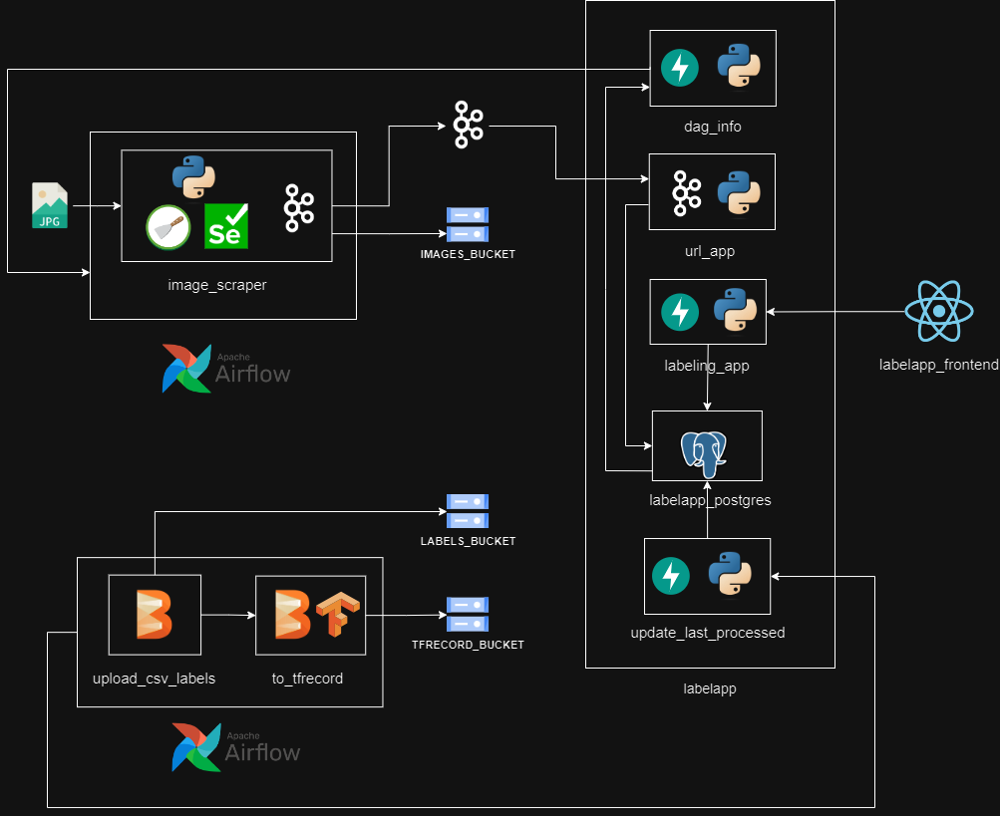

# ml-image-scraping-tool
Data Engineering project for image scraping and data labeling, preparing image data for future use on ML systems.

## Architecture


## Setup (Makefile)

To launch the scrapy spiders (with airlfow) from docker compose
```shell
# Install libraries locally for developing
$ make devenv  # make devenv-windows for windows
# Run the crawler for google images
$ make runspider # make runspider-windows for windows
# Run the whole project (docker compose)
$ make run
# Stop / remove containers
$ make down
```

For beam `to_tfrecord` pipeline (running on spark standalone mode)
```shell
$ make beam-run
# Stop and remove beam and spark containers
$ make beam-down
```
