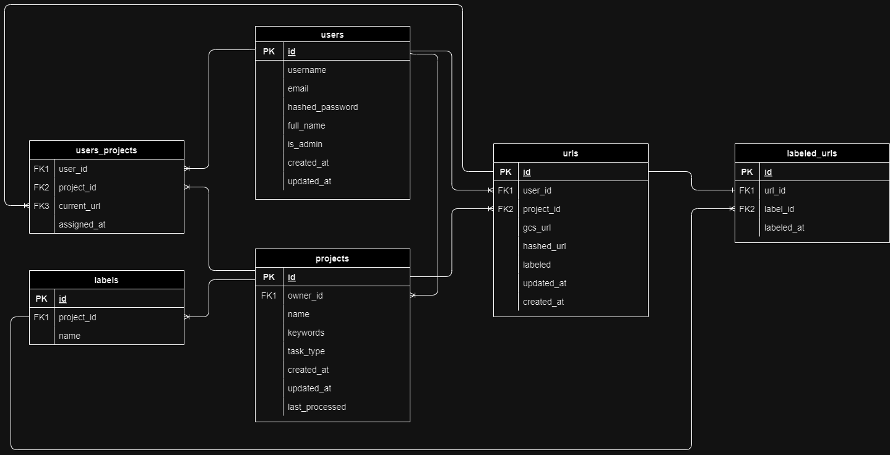

# Labeling App

Microservice used for managing users and projects, made in FastAPI. The following model
is used:



Run app:
```shell
# Setup app for testing
$ docker compose up -d
# Remove containers
$ docker compose down
```